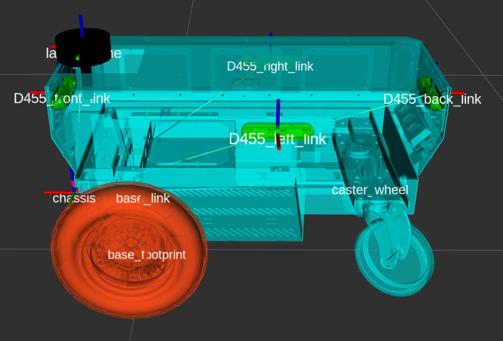
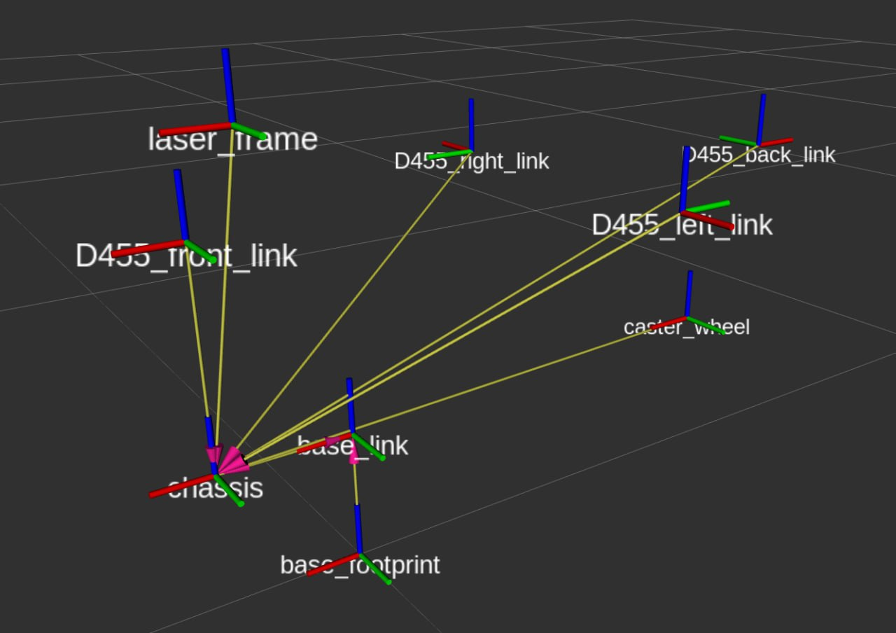

# nvidia carter urdf
super basic package with stls to define the transforms between different frames + links for the nvidia carter robot

# usage
- add package to your  `src` directory in your ros2 workspace
- run `colcon build`
- source your workspace `source ./install/setup.bash` (or something)
- run these commands in separate terminals:

    `ros2 launch nvidia-carter rsp.launch.py`
    
    `rviz2 -d ./src/nvidia-carter/config/carter-config.rviz `

